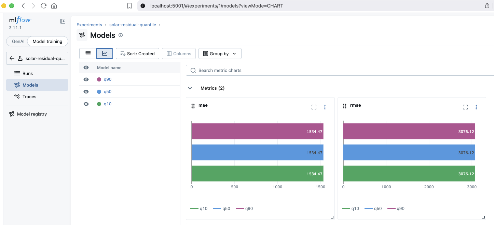
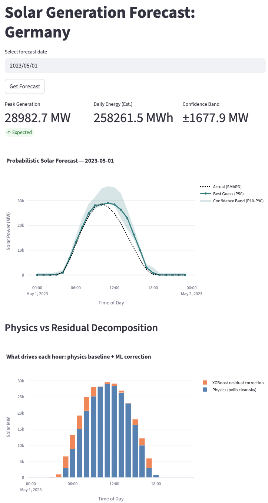
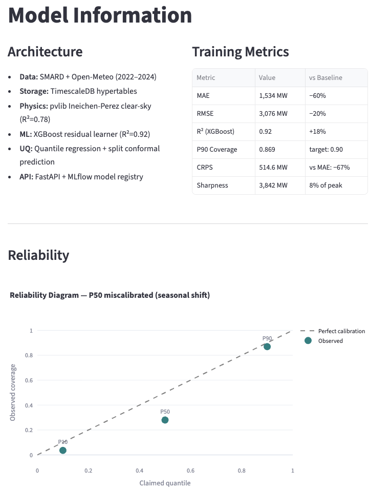
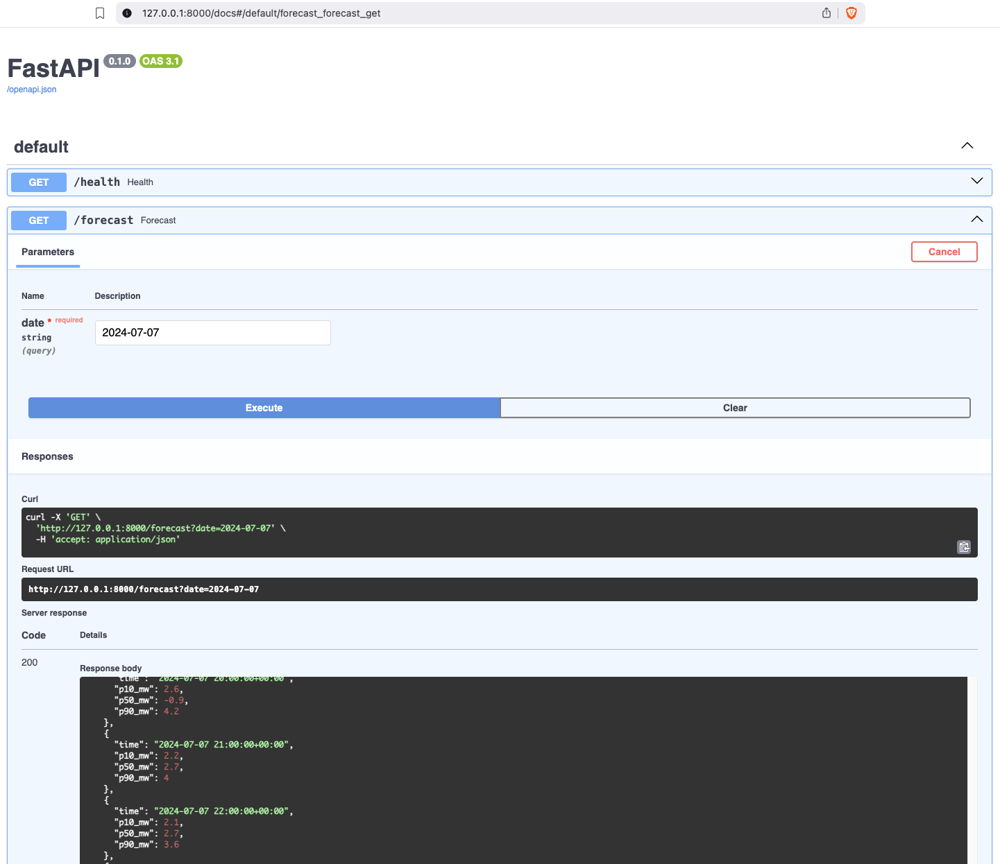

# German Solar Forecasting :  Physics-Informed, Calibration-First

**Probabilistic day-ahead solar generation forecasts for the German grid, where physics provides the principled baseline and machine learning learns only the residual.**

[](https://www.python.org/)
[](https://www.smard.de/)
[]()
[](LICENSE)

> Not another XGBoost-vs-LSTM comparison. This repo tackles the two things most portfolio forecasting projects skip: **physical grounding** (pvlib clear-sky + residual learning) and **calibrated uncertainty** (split conformal + CRPS + reliability diagrams). And it is run as a research project, public Kanban, ADRs, risk register, retrospectives.

---

## Table of Contents
1. [The problem](#1-the-problem)
2. [The approach](#2-the-approach)
3. [Data](#3-data)
4. [Architecture](#4-architecture)
5. [Results](#5-results)
6. [How this repo is managed](#6-how-this-repo-is-managed)
7. [Tech stack](#7-tech-stack)
8. [How to run](#8-how-to-run)
9. [Key design decisions (ADRs)](#9-key-design-decisions)
10. [Project structure](#10-project-structure)
11. [About the author](#11-about-the-author)

---

## 1. The problem

Germany's Energiewende targets 80% renewables by 2030. Solar is volatile and weather-dependent; operators cannot dispatch it like a gas plant.

The operational problem:

- A 10% solar forecasting error at midday peak costs real money on the balancing spot market.
- Operators do not want a point estimate ("~12 GW at noon"). They want a **calibrated probabilistic forecast**: "12 GW ± 2 GW, 80% interval guaranteed to contain the truth 80% of the time on average."
- Most open-source forecasting stops at RMSE. This repo measures calibration explicitly and reports it honestly.

---

## 2. The approach :  physics, then residuals, then calibrated UQ

### 2.1 Physics-informed forecasting

Instead of feeding weather into a black-box model and hoping it learns physics, we **compute the physics directly**:

- **Clear-sky irradiance** via pvlib (Ineichen-Perez model using solar position, air mass, Linke turbidity)
- **Solar geometry** for German latitude, per-hour azimuth and elevation
- An analytical **first-principles power estimate** as the baseline forecast

This baseline already explains most intraday solar variance from first principles, before any ML.

### 2.2 Residual learning

What physics cannot predict: clouds, curtailments, measurement noise, module soiling. We train **XGBoost on the residual** (actual − physics) using SMARD generation, Open-Meteo weather, and SQL-engineered lag / rolling features. The model learns only what physics cannot, smaller, faster to train, easier to interpret.

### 2.3 Calibrated probabilistic forecasts

Three techniques layered:

| Technique | Purpose |
|---|---|
| **Quantile regression XGBoost** (q10/q50/q90) | Native prediction intervals, no distributional assumption |
| **Split conformal prediction** (MAPIE) | Distribution-free coverage guarantee: 80% interval contains the truth ≥80% of the time |
| **CRPS + reliability diagrams** | Honest evaluation of probabilistic sharpness and calibration |

This combination is standard in probabilistic-forecasting research and rare in portfolio projects.

---

## 3. Data

### SMARD :  Bundesnetzagentur
[https://www.smard.de/en](https://www.smard.de/en), Germany's official grid data platform. Hourly solar generation, load, prices. Public REST API, no key required. **The same source that commercial forecasters in DACH work with daily.**

### Open-Meteo
[https://open-meteo.com](https://open-meteo.com), Free historical + forecast weather. Shortwave radiation, cloud cover, temperature at Offenbach (DWD reference station for Germany).

Both land in **TimescaleDB hypertables** for partitioned time-range queries.

---

## 4. Architecture

```
          SMARD API                      Open-Meteo API
              │                               │
              ▼                               ▼
   ┌─────────────────────────────────────────────────┐
   │     TimescaleDB hypertables (raw layer)         │
   └─────────────────────────────────────────────────┘
                         │
                         ▼
   ┌─────────────────────────────────────────────────┐
   │   SQL feature views: lag, rolling, time joins   │
   └─────────────────────────────────────────────────┘
                         │
           ┌─────────────┴─────────────┐
           ▼                           ▼
   ┌──────────────────┐      ┌───────────────────────┐
   │ PHYSICS LAYER    │      │ RESIDUAL LAYER        │
   │ pvlib clear-sky  │──────│ XGBoost on residual   │
   │ solar position   │      │ (actual − physics)    │
   └──────────────────┘      └───────────────────────┘
                         │
                         ▼
   ┌─────────────────────────────────────────────────┐
   │                   CALIBRATED UQ                 │
   │ quantile + split conformal + CRPS + reliability │
   └─────────────────────────────────────────────────┘
                         │
             ┌───────────┴────────────┐
             ▼                        ▼
        FastAPI /forecast     Streamlit dashboard
        (→ P3 Tool D)         (public demo)
```

---

## 5. Results

*Live-updated as each phase completes. Weekly reports in [`docs/pm/weekly/`](docs/pm/weekly/).*

### Headline numbers

| Metric | Physics-only | Physics + XGBoost | + Conformal UQ |
|---|---|---|---|
| R² | 0.78 | 0.92 | n/a |
| MAE (MW) | 3,856 | 1,552 | n/a |
| RMSE (MW) | n/a | 3,076 | n/a |
| P90 empirical coverage | n/a | n/a | 0.869 |
| CRPS (MW) | n/a | n/a | 514.6 |
| Sharpness P10-P90 (MW) | n/a | n/a | 3,842 |



### Dashboard





### What the ablation teaches

Adding the XGBoost residual layer reduces MAE by 60% over the physics baseline. The physics layer is not redundant: `physics_pred` is the top feature by importance, meaning XGBoost amplifies and corrects the physics signal rather than ignoring it. P50 is miscalibrated (observed coverage 0.28 vs claimed 0.50) due to seasonal exchangeability violation in the calibration split; P90 hits target. Both limitations are documented in ADR-003.

---

## 6. How this repo is managed

This project is run as a **22-day research sprint** with PM artifacts a recruiter can audit:

- 📋 **Kanban:** [`docs/pm/kanban.md`](docs/pm/kanban.md): daily state of work
- 📜 **Architecture Decision Records:** [`docs/pm/decisions/`](docs/pm/decisions/): every judgement call, documented
- ⚠️ **Risk register:** [`docs/pm/risk-register.md`](docs/pm/risk-register.md): risks identified + mitigated over time
- 📅 **Weekly reports:** [`docs/pm/weekly/`](docs/pm/weekly/): committed vs delivered, blockers, metrics
- 🔄 **Retrospectives:** [`docs/pm/retros/`](docs/pm/retros/): Start / Stop / Continue after each phase
This is what scientific project management looks like, applied to industrial AI.

---

## 7. Tech stack

| Layer | Tool | Why |
|---|---|---|
| Storage | PostgreSQL 16 + TimescaleDB | Plain Postgres underneath; hypertables for fast time-range queries |
| Data | SMARD REST API, Open-Meteo REST API | Real industry data, zero synthetic |
| Physics | pvlib | Community reference for solar PV modeling |
| ML | XGBoost | Best-in-class on tabular residuals |
| UQ | MAPIE, properscoring | Split conformal + CRPS |
| MLOps | MLflow (file backend) | Experiment tracking without server overhead |
| API | FastAPI + Pydantic | Typed, auto-docs, production-credible |
| UI | Streamlit + Plotly | Interactive demo, no frontend cost |
| Deploy | Docker + docker-compose | One-command spin-up |
| CI | GitHub Actions | ruff + pytest on every push |

---

## 8. How to run

### Prerequisites
- Docker Desktop (or Docker Engine)
- Git

### One-command startup

```bash
git clone https://github.com/DR-DKP/german-renewable-forecasting.git
cd german-renewable-forecasting
docker compose up --build
```

Then:
- Dashboard → http://localhost:8501
- API docs → http://localhost:8000/docs
- MLflow UI → http://localhost:5000



### For local development

```bash
python -m venv .venv && source .venv/bin/activate
pip install -r requirements.txt
docker compose up timescaledb        # just the DB
jupyter lab                          # work in notebooks/
```

---

## 9. Key design decisions

Full ADRs in [`docs/pm/decisions/`](docs/pm/decisions/). Headlines:

- **[ADR-000](docs/pm/decisions/ADR-000-scope.md): Deliberate scope:** solar only, DE aggregate, no LSTM, no wind in v1.
- **[ADR-001](docs/pm/decisions/ADR-001-physics-model-choice.md): pvlib Ineichen-Perez:** why physics-informed over pure ML.
- **[ADR-002](docs/pm/decisions/ADR-002-xgboost-residual-learner.md): XGBoost residual learner:** why residual target over direct forecasting.
- **[ADR-003](docs/pm/decisions/ADR-003-calibrated-uq.md): Split conformal over bootstrap:** distribution-free coverage guarantees.
- **[ADR-004](docs/pm/decisions/ADR-004-api-and-deployment.md): FastAPI + Docker:** serving layer design and P3 API contract.

---

## 10. Project structure

```
german-renewable-forecasting/
├── README.md                      # You are here
├── docker-compose.yml
├── Dockerfile
├── requirements.txt
├── requirements-app.txt
├── environment.yml
├── api/               main.py     # FastAPI /forecast + /health
├── app/               streamlit_app.py
├── src/
│   ├── data/          # SMARD + Open-Meteo clients
│   ├── features/      # SQL views + dataset assembly
│   ├── physics/       # pvlib clear-sky + solar geometry
│   ├── models/        # Residual XGBoost + quantile variants
│   ├── uncertainty/   # Conformal prediction wrappers
│   └── evaluation/    # CRPS, reliability diagrams, metrics
├── notebooks/         # 01 ingestion … 05 UQ evaluation
├── tests/             # pytest: data, features, models, API
├── docs/
│   ├── pm/            # Kanban, ADRs, risk register, weekly, retros
│   ├── wiki/          # Concept notes + debugging + interview prep
│   └── blog/          # Write-up drafts
└── data/              # Raw / processed (git-ignored)
```

---

## 11. About the author

**Dr. Deepak K. Pandey**, physicist transitioning into industrial AI. 10 years of experimental physics (femtosecond spectroscopy, UHV systems, uncertainty propagation); now applying that discipline to renewable-energy forecasting and agentic AI systems.

- Website: [drdkp.com](https://drdkp.com)
- LinkedIn: [linkedin.com/in/drdkp](https://linkedin.com/in/dr-deepak-k-pandey)
- Companion projects:
  - **P1**: Predictive Maintenance on NASA C-MAPSS, *(separate repo: industrial-systems-monitoring)*
  - **P3**: Sensor Intelligence Assistant (LLM agent), *(coming May 2026)*

---

**MIT License.** See [LICENSE](LICENSE).

*Built as a focused portfolio sprint, April–May 2026.*

